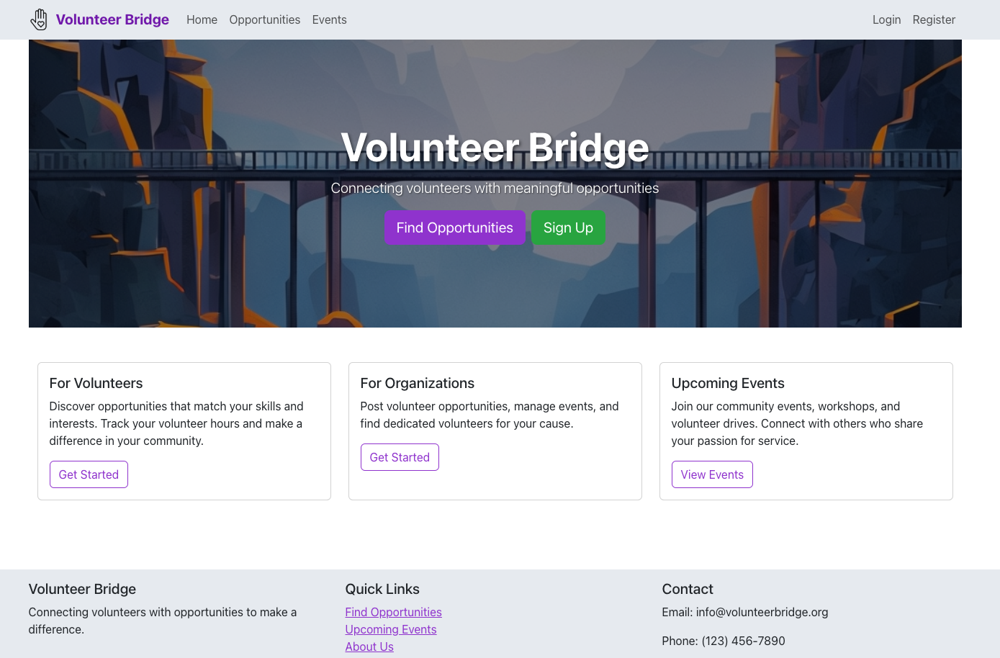

# Volunteer Bridge
A Django-based volunteer management platform that streamlines connections between organizations and volunteers.

## 🌟 Core Features
### Account Management
Custom user authentication and authorization\
Role-based permissions system\
Profile management
### Opportunity System
Opportunity creation and management\
Advanced matching algorithm\
Custom serialization for API responses
### Volunteer Hours Tracking
Digital hour logging and verification\
Automated tracking system\
Reporting capabilities

## 🛠️ Technology Stack
### Backend
Django REST Framework\
PostgreSQL\
JWT Authentication
### Coming Soon
Frontend: React + Bootstrap\
Deployment: Heroku

## 🚀 Getting Started
### Clone the repository
`git clone https://github.com/yourusername/volunteer-bridge.git`\
`cd volunteer-bridge`
### Create and activate virtual environment
`python -m venv venv`\
`source venv/bin/activate`   Windows: `venv\Scripts\activate`
### Install dependencies
`pip install -r requirements.txt`
### Configure environment variables
`cp .env.example .env` Edit .env with your configuration
### Run migrations
`python manage.py migrate`\
### Start development server
`python manage.py runserver`

## 🤝 Contributing
1. Fork the repository
2. Create your feature branch (git checkout -b feature/AmazingFeature)
3. Commit your changes (git commit -m 'Add some AmazingFeature')
4. Push to the branch (git push origin feature/AmazingFeature)
5. Open a Pull Request
